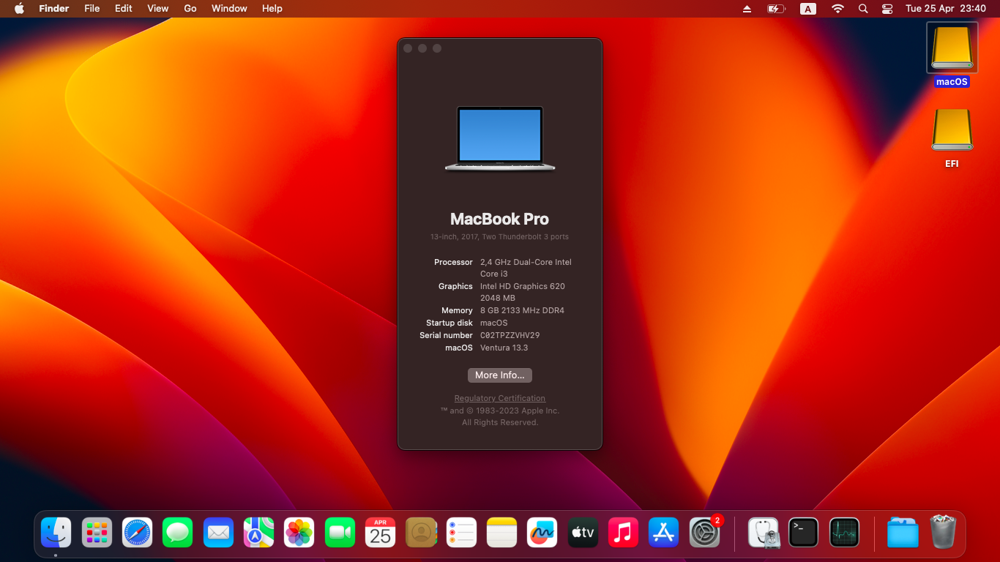

# Ventura-On-Dell-Inspiron-3567

# Specs:
- CPU:	Intel Core i3 Kabylake, 7020U, 2.30 GHz
- Display: 15.6”, HD (1366 x 768), TN
- GPU: Intel Integrated HD Graphics 620
- USB Ports:	1 x USB 2.0, 2 x USB 3.0
- Connectivity: Intel AC 3165
- Ethernet: RTL810xE PCI Express Fast Ethernet controller
- Audio Adapter: Realtek ALC256 - High Definition Audio Controller

# Working:
- Intel HD Graphics 620 2048 MB
- Restart and Shutdown
- CPU Power Management
- Wifi (Intel AC-3165)
- Ethenet 
- Audio (Realtek ALC 256)
- Brightness Key (F11, F12)
- Volumes Key (F1, F2, F3)
- Touchpad
- HDMI Port
- All USB Ports
- SDCard Port 
- Bluetooth 

# Not Working:
- Airdrop

# Preview macOS on Dell Inspiron 15 3567:

# Screenshot:

# Download EFI (Opencore Mod 0.9.2)
- https://github.com/quangvinhdam/Ventura-On-Dell-Inspiron-3567/releases/tag/0.9.2

# Credits
- [Apple](https://apple.com) For macOS.
- [Acidanthera](https://github.com/acidanthera) For OpenCore and all the lovely hackintosh work.
- [Olarila](https://www.olarila.com/) For great guides and offline installer.
- [Dortania](https://dortania.github.io/OpenCore-Install-Guide) For great and detailed guides.
- [opencore-mod] (https://github.com/topics/opencore-mod)
- [VNOHackintosh](https://facebook.com/VNOHackintosh) Support group for installation and post installation.
